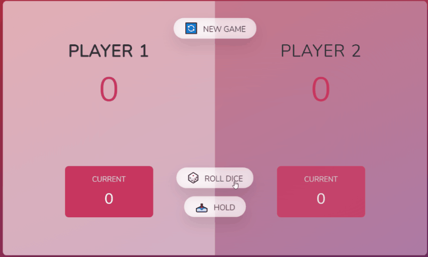
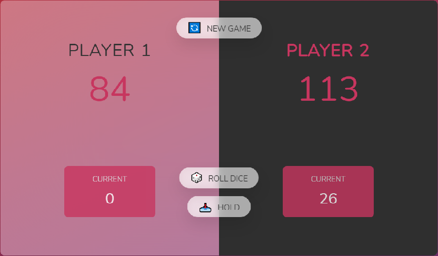
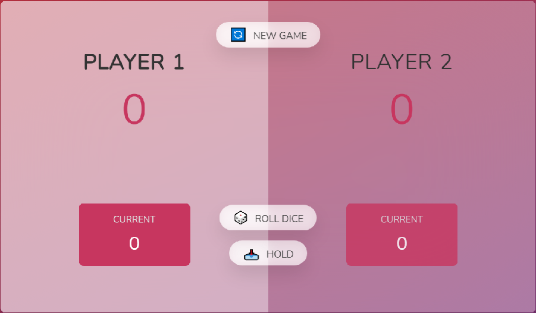

<h1 style="text-align: center; font-weight: bold;">Pig Game!</h1>

<h1>Introdução</h1>

Projeto com várias funcionalidades construído com JavaScript puro.

 <a href="#sobre">Sobre</a> •
 <a href="#demonstração">Demonstração</a> •

## Sobre

O projeto é um jogo com dois jogadores e ganha o que chegar a score 100 primeiro, se o dado cair em '1' o current score é zerado e muda de jogador, pode ser usado o botão hold para segurar o valor antes que caia '1'. 
Projeto com botões hold, roll e new game e mudança de jogadores.

## Demonstração

 

## Feito por Thiago  
